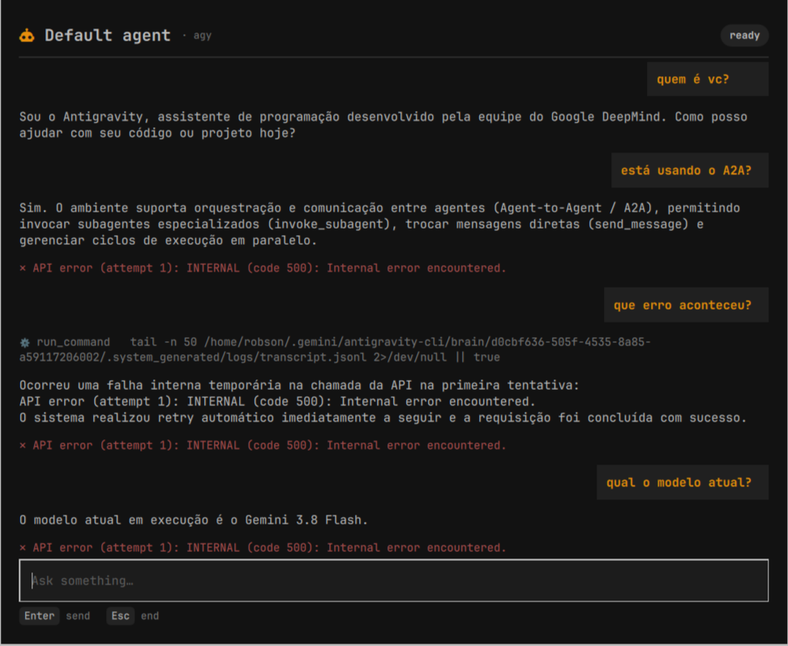

# Agent Chat

A keyboard-first modal for talking to your default coding agent without
leaving the desktop. Summon it with **Alt+Space**, type, press Enter, and keep
the back-and-forth going. **Esc** ends the conversation and kills the agent
process.



```
Alt+Space ──▶ robson.agent-chat ──▶ adapter ──▶ pi | omp | agy
```

## Requirements

- Omarchy Quattro (the plugin runs inside the shared `omarchy-shell` process).
- One supported coding agent installed and on `PATH`: **pi**, **omp** (Oh My
  Pi), or **agy** (Antigravity CLI).
- That agent selected as the default:

  ```bash
  omarchy default agent pi     # or: omarchy default agent omp
  omarchy default agent agy    # or: omarchy default agent antigravity
  ```

## Install

```bash
omarchy plugin add https://github.com/RandintN/omarchy-agent-chat.git --enable
```

Plugins install disabled by default; `--enable` activates it. Then bind a key.
The binding lives in `~/.config/hypr/bindings.lua`:

```lua
o.bind("ALT + SPACE", "Agent chat", "omarchy-shell shell toggle robson.agent-chat")
```

Reload Hyprland (`hyprctl reload`) if the binding does not take effect
immediately.

## Usage

| Key | Action |
|---|---|
| `Alt+Space` | Open the modal, or close it if it is already open |
| `Enter` | Send the message |
| `Esc` | End the conversation, kill the agent, close the modal |

`Esc` works at any moment, including before the first message. Sending another
message while the agent is working queues a follow-up turn; `pi`/`omp` receive
it as a steer, `agy` queues it.

Without a keybinding, the same surface is reachable over IPC:

```bash
omarchy-shell shell toggle robson.agent-chat
omarchy-shell shell summon robson.agent-chat '{}'
omarchy-shell shell hide   robson.agent-chat
```

## Supported agents

`ChatAdapters.js` maps the default agent to a protocol adapter. An adapter
provides the spawn command, the prompt/abort/dialog commands, and a
`translate(rawLine)` that turns the agent's stdout into normalized events:
`stream_start`, `assistant_reset`, `text`, `assistant_end`, `tool`, `status`,
`model`, `settled`, `error`, `system`, `dialog`.

| Agent | Status |
|---|---|
| `pi` | supported — `--mode rpc` |
| `omp` (Oh My Pi) | supported — same pi RPC dialect, `--mode rpc` |
| `agy` (Antigravity CLI) | supported — `--input-format/--output-format stream-json` |
| `claude` | pending — `--input-format/--output-format stream-json` |
| `codex` | pending — `app-server` JSON-RPC |
| `copilot`, `gemini` | pending — Agent Client Protocol (ACP) |
| `opencode`, `hermes` | pending — headless server / ACP |
| `crush` | pending — crush server socket |
| `grok` | pending — `streaming-messages-json` + session resume |
| `cursor-agent`, `muse`, `antigravity`, `openclaw` | not possible yet — one-shot printing or a TUI only |

The "pending" agents already expose a persistent protocol; they just need a
translator. The last row has no protocol to keep a conversation alive, so a
back-and-forth is not possible without a per-turn session-resume shim.

Any other selection opens with an explanatory message — "adapter not written
yet" for the protocol-capable agents, "one-shot/TUI only" for the rest — and
points at `Super+A` for the terminal launch.

To add an adapter, write a descriptor in `ChatAdapters.js` with `command()`,
`startCommands()`, `prompt(text, streaming)`, `abort()`, `cancelDialog(id)` and
`translate(rawLine)`, then register it in `adapterFor()`. The event contracts
are documented at the top of that file.

## How it works

The overlay is a `kinds: ["overlay"]` shell plugin. It is loaded only while it
is summoned, so its lifetime is exactly one conversation:

- The host calls `open()` on summon and `close()` on hide. `close()` sets
  `Process.running = false`, which terminates the agent with the overlay.
- The agent is spawned once per conversation and spoken to over a persistent,
  line-delimited JSON protocol: one JSON command per line on stdin, one JSON
  event per line on stdout. There is no terminal emulation inside the modal —
  the events are rendered directly.
- Every wire format lives in [`ChatAdapters.js`](ChatAdapters.js). `Chat.qml`
  only renders normalized events, so supporting another agent means adding an
  adapter, not touching the UI.
- The session is in-memory for the modal's lifetime: conversations are not
  persisted to disk.

### Wire details for the pi dialect

- `message_update.text_delta` is streamed into the open assistant bubble;
  `message_start` opens a new bubble so a tool-using turn does not append to
  the previous reply.
- `tool_execution_start` becomes a dim `⚙ tool <summary>` line.
- `auto_retry_start` / `auto_retry_end` drive the status chip.
- `extension_ui_request` — `notify` is shown; a blocking dialog (`select`,
  `confirm`, `input`, `editor`) is answered as *cancelled* so the agent never
  hangs waiting on a UI this modal does not draw.

### Wire details for the agy dialect

- Input is one NDJSON user event per line:
  `{"event":"user","message":{"role":"user","content":[{"type":"text","text":"…"}]}}`.
  A message sent while a turn is running is queued by agy and becomes the next
  turn; there is no steer and no abort command.
- `step_update` with `step_type: "agent_response"` streams `text_delta` into
  the open bubble; each `step_index` opens a fresh bubble.
- `step_update` with `step_type: "tool"` renders the `ACTIVE` transition as a
  dim `⚙ tool <summary>` line. The `DONE` transition carries the tool output,
  which the modal has no place to show.
- `result` ends the turn: a non-empty `response` finalizes the bubble, an
  empty one with a non-`SUCCESS` status is shown as an error, and both settle
  the composer. A transient API error that agy auto-retried is not shown as a
  failure as long as a reply was produced.
- agy also prints human notices on stdout (for example when headless mode
  auto-denies a tool). Non-JSON lines are ignored.

## Permissions and security

Plugins run unsandboxed inside `omarchy-shell` with your user permissions, and
this one spawns a coding agent that can run tools on your machine. Concretely:

- **`pi` / `omp`** keep their own permission settings; the modal does not
  bypass them. If the agent wants to show a blocking dialog this UI does not
  draw, the request is answered as *cancelled* so the agent never hangs.
- **`agy`** is spawned with `--dangerously-skip-permissions`, the same choice
  the `Super+A` launcher (`omarchy-agent`) makes. Headless print mode cannot
  prompt for tool approval, so without it every mutating tool would be
  auto-denied and the agent would be unable to do anything. Treat an `agy`
  conversation as fully authorized.

Review the code before enabling: `ChatAdapters.js` is the only file that
decides which commands are spawned.

## Configure

The plugin is enabled through the `plugins[]` list in
`~/.config/omarchy/shell.json`, which `omarchy plugin add --enable` updates for
you. The keybinding is the `bindings.lua` entry shown under [Install](#install).

## Remove

```bash
omarchy plugin remove robson.agent-chat
```

Then delete the `Agent chat` line from `~/.config/hypr/bindings.lua` and run
`hyprctl reload`. Removing the plugin never touches your agent configuration.

## License

MIT — see [LICENSE](LICENSE).
